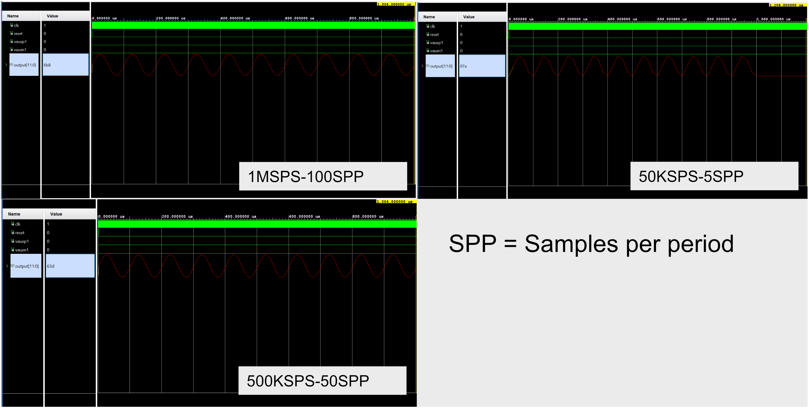

# 🧭 Digital Circuit Design

Before jumping into implementation, it's essential to address a few design questions that guide our development choices. These questions will help shape the architecture of the digital circuit and ensure it meets performance and usability expectations.

---

## 🧠 How will we measure the frequency of the sinusoidal signal from the XADC?

The XADC (Xilinx Analog-to-Digital Converter) gives us a digitized version of the input analog signal. However, to determine the frequency, we must process that data further.

A straightforward and effective method is to use a [frequency counter](https://andybrown.me.uk/2016/02/21/nanocounter/). The idea is to:

- Convert the analog sinusoid to a square wave (e.g., by thresholding).
- Count the number of cycles of the square wave in a given time frame.
- Compare this with a known clock signal to compute frequency.

This approach is hardware-friendly and works well in real-time digital systems.

---

## 🔢 How do we display binary numbers on 7-segment displays?

The frequency counter outputs binary values that aren't human-readable in their raw form. To make these values suitable for display, we’ll convert them into [Binary-Coded Decimal (BCD)](https://en.wikipedia.org/wiki/Binary-coded_decimal).

BCD makes it easier to display numbers on standard 7-segment displays, which are designed for decimal digits.

### Conversion Method

To perform this conversion in hardware, we use the [Double Dabble algorithm](https://en.wikipedia.org/wiki/Double_dabble). It's a simple and effective way to convert binary values into BCD, with low resource usage — perfect for FPGA implementation.

The output will then drive four 7-segment displays, allowing easy real-time monitoring.

---

## ⏱️ What sampling rate do we need?

We are working with a signal approximately **10 kHz** in frequency. To capture the waveform accurately:

- **Minimum sampling rate:** 20 kHz (according to the **Nyquist Theorem**).
- In practice, a higher rate (e.g., 50–100 kHz) might be used to improve accuracy and reliability.

> [!NOTE]  
> **Nyquist Theorem**  
> If a function contains no frequencies higher than BW Hz, it is completely determined by samples taken every 1/(2BW) seconds.

Beyond the basic concept of sampling frequency, it's important to emphasize that, for our frequency counter, we require the highest possible number of samples per second. This is crucial because we need to accurately capture the smooth transitions of the signal, especially as it crosses our reference threshold of 1.5V (the virtual ground or zero reference).

Accurate detection of these transitions is essential for reliable frequency measurement. A higher sampling rate allows us to pinpoint the exact moments when the signal crosses the reference voltage, minimizing errors due to aliasing or missed transitions.

In the following images, we compare different sampling scenarios to illustrate the challenges and implications of insufficient sampling resolution. 

  

---

## ⚙️ At what frequency will the digital circuit operate?

This project is designed to be deployed on the PYNQ-Z2 development board, which features an external 125 MHz clock source. As a result, our synchronous digital circuit will operate using this 125 MHz clock signal as its primary timing reference. 

> ![Note]
> If a different operating frequency is desired, we can make use of the Clocking Wizard IP core available in Vivado. This tool allows us to generate derived clock signals within a configurable range, enabling greater flexibility in timing and design optimization.

---

## 📡 How do we communicate with the XADC?

Communication with the XADC is done via the **Dynamic Reconfiguration Port (DRP)**. This port allows us to:

- Read samples from the analog input channels.
- Configure parameters such as sampling rate and averaging.
- Monitor internal signals like temperature or supply voltage if needed.

### Helpful Resources

- [Dynamic Reconfiguration Port Documentation](https://docs.amd.com/r/en-US/pg165-cmac/Dynamic-Reconfiguration-Port)  
- [XADC User Guide for 7 Series FPGAs and Zynq-7000 SoC](https://docs.amd.com/r/en-US/ug480_7Series_XADC)

---

## 🚧 What's next?

The next steps in this project include:

1. **Implementing the frequency counter** in VHDL.
2. **Designing the binary-to-BCD converter** using Double Dabble and VHDL.
3. **Driving the 7-segment display** to visualize the signal frequency.
4. **Integrating with the XADC** using the DRP.

---

## 📖 XADC wizard: Basic setup

