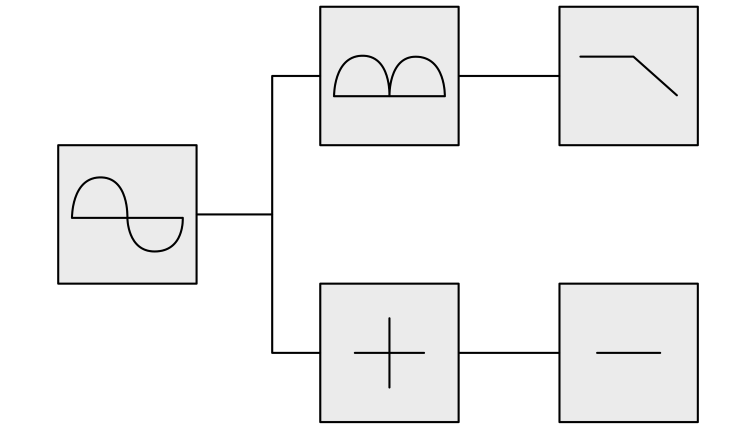
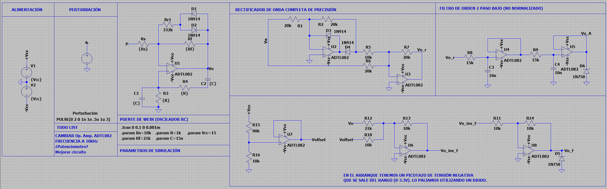
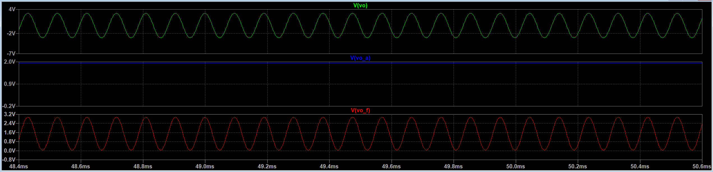
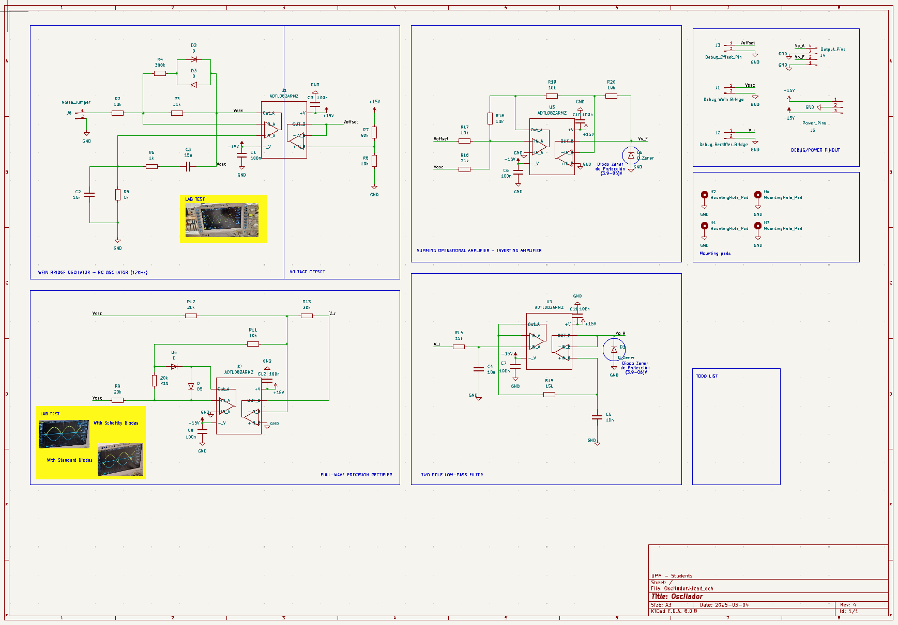
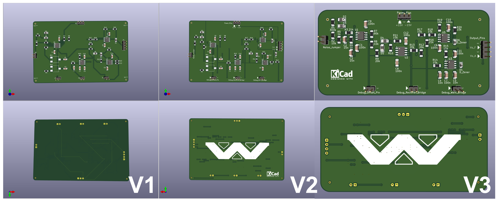
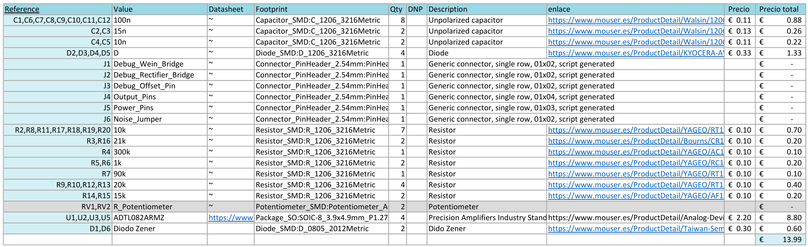

# __OsciBoard__: Wein Bridge Oscillator

This repository documents the design, build and test process of a Wein Bridge Oscillator.

Consequently, in this archive you could find the steps that have been followed to achieve the objective of the proyect. Futhermore, aditional comments and thoughts will be added, as the work has followed an iterative process of improvement. 

## Objective
The work consists on design and implement of a sinusoidal oscillator working at 10kHz. For this purpose it has been proposed a basic Wein Bridge Oscillator circuit which output signal could then be improved throught the addition of a variable gain circuit. Futhermore, the output signal generated will be analyzed with a digital circuit. Therefore the signal should be conditionated to this purposed. 

For analysing the output signal with a digital system we will need to digitalize it. For this, we will use an ADC (analog-digital converter) integrated in a SoC (System on Chip) which also include a programmable logic (FPGA) and two micropocessors. For this reason, the valid range of voltages for the output signal should be between 3.3-0V. Additionally, some measures should be taken to avoid providing prohibited voltages. 

From the digitalized signal we want to measure the frequency of the oscilation and the amplitud, through a digital system deployed in the programmable logic of the SoC. In addition, the value of the frequency we will be displayed on a 7 segments display from a shield connected in the development board.

## Simulations
In the following section, we describe the solution proposed, in other words, the system. This description consists on the selection of stages of our system and the simulation of it. 

### Solution
> [!IMPORTANT]
> We are restricted to the usage of a Wein Bridge, as a condition of the proposed work. 
> This kind of circuit adjust well to our range of work, it's cheap and doesn't have a problematic boot.

The proposed solution consists on a Wein Bridge oscillator with a variable gain that generates one sinusoidal signal that will fed two subcircuits.

One subcircuit consists on a summing operational amplifier where an offset is introduced to the signal at the same time is scaled down and an inverting operational amplifier, in cascade with the previous stage, adjust the sinusoidal signal to positive voltages as the previous stages inverts the signal. Thus, this subcircuit is in charge of generating a signal for measuring the frequency of the oscillation.

The other subcircuit consists on full wave precision rectifier with a two pole low pass filter in cascade that allow us to generate a signal for measuring the amplitud of the signal generated by the Wein Bridge.

> [!WARNING]
> In this kind of proyect, in which we work with signals that carries information, is imperative the usage of precision rectifiers as other modifies considerably the signal.

The approach of the solution based on the generation of two signals, one for the measure of the amplitude and the other for the frequency, have been chosen arbitrarily. However, this approach give us the oportunity of implement and experiment with different circuits.

> [!CAUTION]
> We could have select a normalized filter as the Chebyshev filter. However, we are not working on a restrictive enviorament and the only relevant constrain is the unity gain of the filter. For this reason we have choosen this one as the implementation in the laboratory of other topologies presented some problems related to the gain. However, improved versions of this work could be achieved through the usage of normalized filters.

  

The system have been simulated as a whole thanks to the LTSpice tool provided by the manufacturer Analog Devices. We selected this tool as our main simulation tool for being free and provide out of the box most of the models of the components being use. 

> [!NOTE]
> The value of the components used in the simualtion are a combination of manual adjustment through trial and a first approach based on the theory. The theory that we apply comes from the book of "Fundamentals of Electronics: Oscillators and Advanced Electronics Topics".

### Results
Three signal have been identified as critical: Wein Bridge Oscillator output signal, frequency output signal and amplitd output signal. For this signals, the simulation represents the following results which are coherent with the theory calculations.

> [!NOTE]
> Beyond the mentioned signals, the simulation also give us unvaluable insight knowladge on the circuit in form of intermediary signals that we will use to debug the behaviour of the real circuit.

## Lab Tests
Once the simulation have been developed and validated through the especification of the proyect, we propose the test of the core blocks of our system, as a more detailed test is more expensive in time and resources and the errors that could be detected are not as much critical. 

> [!NOTE]
> Our first approach reduce the lab tests to only the Wein bridge oscillator but this led to not detecting errors in the full wave precision rectifier block before sending the schematics to be build. This was an error that should be avoid in future proyects.

### Wein Bridge Oscillator

Without the variable gain circuit the oscilation presents saturation an no control over the amplitud.

### Full Wave Precission Rectifier

> [!NOTE]
> Our first assembly used standard diodes which caused distorsion on the signal. This was corrected through the usage of sckottchy diodes with fast recovery time.

## PCB Design
This step was made in parallel with the lab tests of the solution. We use the KiCad 8 tool as is a user friendly tool that adjust well to the scope of the proyect.

> [!NOTE]
> Despite the documentation of KiCad is awesome, we have used the book "Design an RP2040 board with KiCad" as our main guideline.

### Schematics
We traduce the schematics define in the simulation to the schematics of the tool. It also give us the oportunity of anotate some key aspects, select the footprint of the components, which help us to selected them, and give a more formal approach to the proyect.

### Layout
As important as our schematics is the layout. For implementing the layout we have taken an iterative approach in which every step introduce a little improvement or correction. 

We have added as much debug pins as we can because it increase the observability of our system. 

> [!CAUTION]
> A big mistake that should be highlighted are the debug pins, as exists standard debug pins an our implementation could make a shortcircuit when measuring. Thus, in future work we should use the standard debug pins as they are more friendly with debugging with the osciloscope probes. 

> [!NOTE]
> Something that should be considered before starting the layout are the capabilities of the manufacturer. Thus, before starting the layout we recommend selecting the manufacturer as they restrict some parameters.

As can be percieved, we have taken advantage of flooded zone, as it help us to deal with power pins connections more easily and introduce shielding to some components relativebly sensible to noise. 

> [!NOTE]
> In future works we would like to correct the usage of vias on the pads as they are a bad practice that affects the quality of the solder connection of the components.

### Components Selection
For the selection of components we need to take into account that the component will be soldered by ourselfs. Therefore, we restrict our selection to normalize footprints of 1206, and 0805 that allow easy handsoldering. 

> [!IMPORTANT]
> When working with circuits were the value of the components can make the difference between a working circuit and fail circuit we recommend try ranges values. Despite testing our system in a protoboard and validate the value of the components selected, in our first implementation in the PCB a resitance component cuase the failure of the whole system as the Wein Bridge doesn't oscillate. This was due the tolerance of the value and was detected thanks to debugging and simulating the real circuit. However, this was a painfull situation that last more than eight hours. 

#### Purchase
Also, we restrict our purchase to a unique electronic shop.

> [!NOTE]
> Before buying anything we recommend to be sure that taxes are dealed by the shop. 

## Results
In the following images we could observe the board being tested. 

### Soldering

