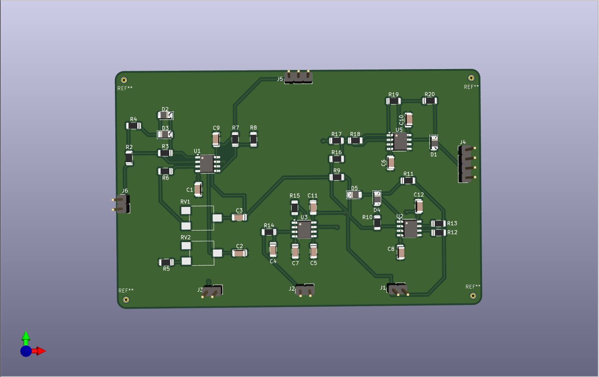
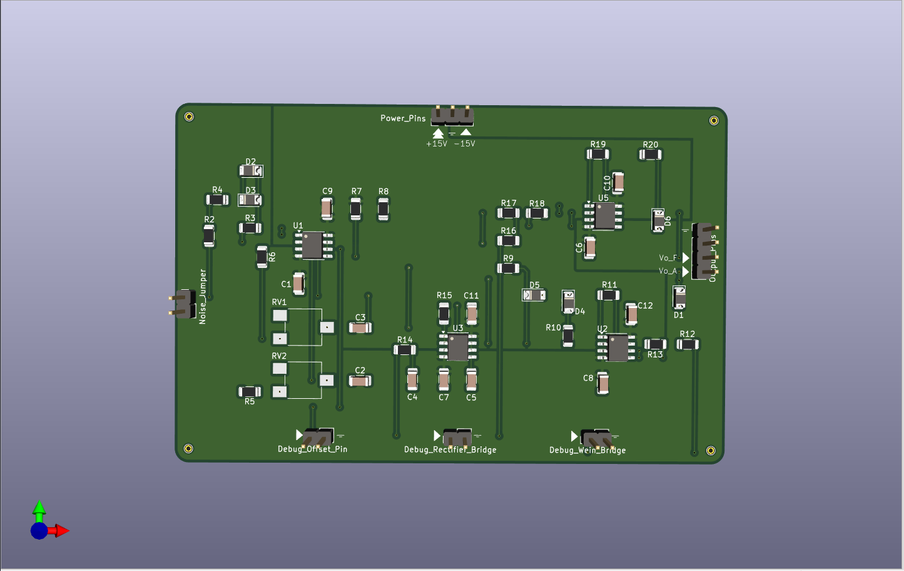
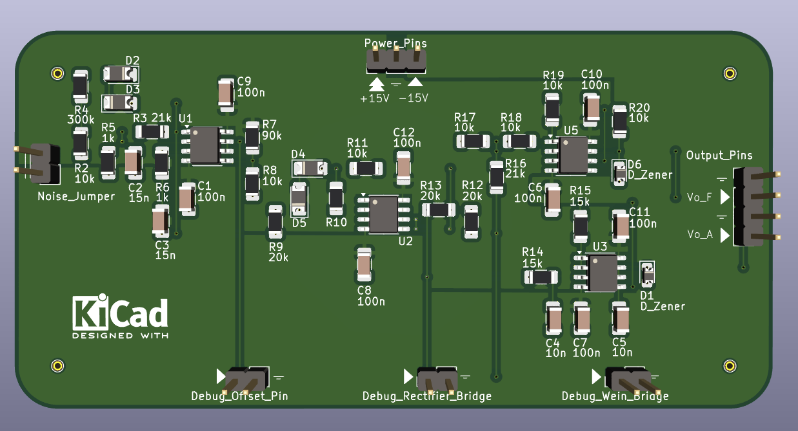

# __OsciBoard__: Wein Bridge Oscillator

This repository documents the design, build and test process of a Wein Bridge Oscillator.

Consequently, in this archive you could find the steps that have been followed to achieve the objective of the proyect. Futhermore, aditional comments and thoughts will be added, as the work has followed an iterative process of improvement. 

## Objective
The work consists on design and implement of a sinusoidal oscillator working at 10kHz. For this purpose it has been proposed a basic Wein Bridge Oscillator circuit which output signal could then be improved throught the addition of a variable gain circuit. Futhermore, the output signal generated will be analyzed with a digital circuit, therefore, the signal should be conditionated to this purposed. 

For analysing the output signal with a digital system we will need to digitalize it. For this, we will use an ADC (analog-digital converter) integrated in a SoC (System on Chip) which also include a programmable logic (FPGA) and two micropocessors. For this reason, the valid range of voltages for the output signal should be between 3.3-0V. Additionally, some measures should be taken to avoid providing prohibited voltages. 

From the digitalized signal we want to measure the frequency of the oscilation and the amplitud, through a digital system deployed in the programmable logic of the SoC. In addition, the value of the frequency we will be displayed on a 7 segments display.

## Simulations

### Solution
The proposed solution consists on a Wein Bridge oscillator with a variable gain that generates one sinusoidal signal that will fed two subcircuits. The first one consists on a summing operation amplifier where an offset is introduced to the signal and an inverting operational amplifier that adjust the sinusoidal signal to the valid range. Thus, this subcircuit is in charge of generating a signal for measuring the frequency of the oscillation. The other subcircuit consists on full wave precision rectifier with a two pole low pass filter that allow us to generate a signal for measuring the amplitud of the signal generated by the Wein Brdige.

The system have been simulated as a whole thanks to the LTSpice tool provided by the manufacturer Analog Devices. 

> [!NOTE]
> The value of the components used in the simualtion are a combination of manual adjustment through trial and a first approach based on the theory. The theory that we apply comes from the book of "Fundamentals of Electronics: Oscillators and Advanced Electronics Topics".
### Results
Three signal have been identified as critical: Wein Bridge Oscillator output signal, frequency output signal and amplitd output signal. For this signals, the simulation represents the following results which are coherent with the theory calculations.

> [!NOTE]
> Beyond the mentioned signals, the simulation also give us unvaluable insight knowladge on the circuit in form of intermediary signals that we will use to debug the behaviour of the real circuit. 
## Lab Tests
Once the simulation have been developed and validated through the especification of the proyect, we propose the test of the core blocks of our system, as a more detailed test is more expensive in time and resources and the errors that could be detected are not as much critical. 

> [!NOTE]
> Our first approach reduce the lab tests to only the Wein bridge oscillator but this led to not detecting errors in the full wave precision rectifier block before sending the schematics to be build. This was an error that should be avoid in future proyects.

### Wein Bridge Oscillator

Without the variable gain circuit the oscilation present saturation an no control over the amplitud.

### Full Wave Precission Rectifier

> [!NOTE]
> Our first assembly use standard diodes wich cause distorsion on the signal. This was corrected through the use of sckottchy diodes with fast recovery times.

## PCB Design
This step was made in parallel with the lab tests of the solution. We use the KiCad 8 tool as is a user friendly tool that adjust well to the scope of the proyect.

> [!NOTE]
> Despite the documentation of KiCad is awesome, we have used the book as our main reference "Design an RP2040 board with KiCad"

### Schematics
We traduce the schematics define in the simulation to the schematics of the tool. It also give us the oportunity of anotate some key aspects, select the footprint of the components and give a more formal approach to the proyect.

### Layout
As important as our schematics is the layout. For implementing the layout we have taken an iterative approach in which every step introduce a little imporvement our correction. 

We have added as much debug pins as we can because it increase the observability of our system. 

> [!NOTE]
> Something that should be considered before starting the layout are the capabilities of the manufacturer. In our case we select JCLPCB which provide great guides for adjust the design to its capabilities.

As can be percieved, we have taken advantage of flooded zone, as it help us to deal with power pins connections more easily. 

> [!NOTE]
> In future works we would like to correct the usage of vias on the pads as they are a bad practice that affects the quality of the solder connection of the components.
### Components Selection
For the selection of components we need to take into account that the component will be soldered by ourselfs. Therefore, we restrict our selection to normalize footprints of 1206, and 0805 that allow handsoldering. 

#### Purchase
Also, we restrict our purchase to a unique electronic shop.

> [!NOTE]
> Before buying anything we recommend to be sure that taxes are dealed by the shop. 

## Results
As the time of writing we are waiting for the arrival of the PCBs. When they arrive we are going to conduct tests on the conections and visual inspections before start soldering. 

### Soldering

### Tests

