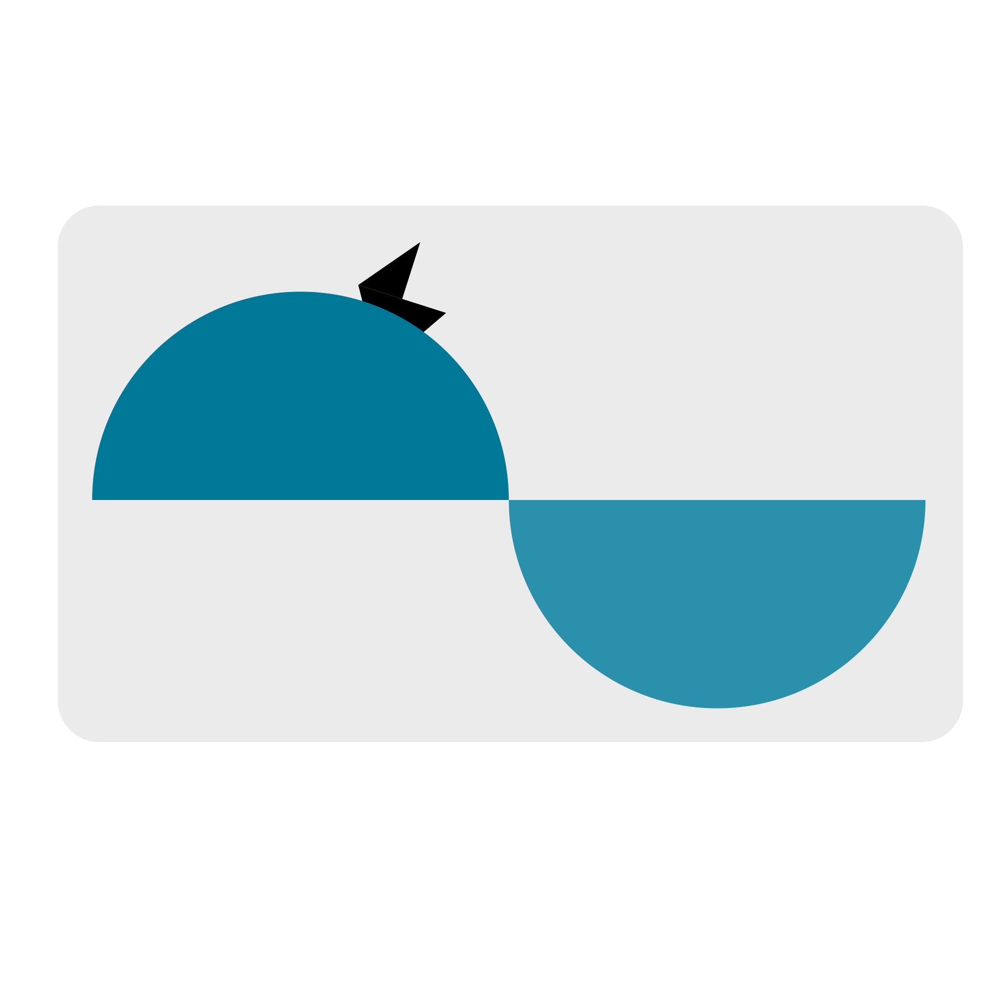

# __OsciBoard__: Wein Bridge Oscillator

  

## 👋 Welcome

This repository walks you through the design, build, and testing process of a Wien Bridge Oscillator.

Inside, you'll find the steps we followed to bring the project to life, along with additional thoughts and notes added along the way. Since this has been an iterative process, we’ve included reflections and improvements made throughout the journey.

## 🎯 Objective

The goal of this project is to design and implement a sinusoidal oscillator operating at 10 kHz. To achieve this, we’ve chosen a classic Wien Bridge Oscillator as our base circuit. From there, the signal will be enhanced using a variable gain stage to improve performance and stability.

To analyze the oscillator’s output, we’ll be using a digital system. This means the signal needs to be conditioned and digitized before processing. For digitization, we'll use the ADC (Analog-to-Digital Converter) integrated in a System on Chip (SoC). This SoC includes:

- A programmable logic section (FPGA)

- Two microprocessors

Because of this setup, the oscillator's output voltage must remain within the 0 to 3.3V range to be safely read by the ADC. Protective measures will also be implemented to prevent any out-of-range voltages.

Once the signal is digitized, we aim to measure two key parameters:

- The frequency of the oscillation

- The amplitude of the waveform

The frequency value will be displayed on a 7-segment display connected via a shield to the development board.

## 🧪 Simulations
In this section, we describe the proposed system in more detail—breaking down the main stages and showing how we simulated each part. 

### 💡 Solution Overview
> [!IMPORTANT]
> We're required to use a Wien Bridge Oscillator as a constraint of this project.
> Fortunately, this type of oscillator is a great fit for our goals—it’s inexpensive, well-suited for our frequency range, and has a smooth startup behavior.

Our solution is built around a Wien Bridge Oscillator with adjustable gain. The oscillator generates a sinusoidal signal that is sent to two separate subcircuits:

---

### 🔎 Subcircuit 1: Frequency Measurement Path

This branch of the circuit is responsible for preparing the signal so that its frequency can be measured digitally: 

- First, a summing amplifier introduces an offset and scales the signal.

- Then, an inverting amplifier corrects the polarity, resulting in a signal fully within the positive range.

Together, these stages ensure the signal is properly conditioned for reliable digital processing.

---

### 🔎 Subcircuit 2: Amplitude Measurament Path

This second branch is dedicated to measuring the amplitude of the oscillation: 

- A precision full-wave rectifier caaptures the full waveform.

- This is followed by a two-pole low-pass filter, which smooths the signal to provide a stable DC value that reflects the original amplitude.

> [!WARNING]
> In this kind of project, where we're working with signals that carry important information, it's essential to use precision rectifiers—other types can significantly alter the signal. 

The solution we chose is based on generating two separate signals—one for measuring amplitude and the other for frequency. While this approach was selected somewhat arbitrarily, it gives us a great opportunity to implement and experiment with different circuits along the way.

> [!CAUTION]
> We could have gone with a normalized filter, like a Chebyshev filter. However, since we're not working in a restrictive environment and the only key requirement is unity gain, we chose this particular design. In the lab, other topologies ran into some issues with maintaining the correct gain. That said, future improvements could definitely benefit from using normalized filters for better performance.

  

### 🖥️ Simulation Enviorament 

The entire system was simulated using LTSpice, a tool provided for free by Analog Devices. We chose LTSpice as our main simulation environment because it's free and includes most of the component models we’re using out of the box.

> [!NOTE]
> The component values used in the simulation were selected through a combination of theoretical calculations and manual tuning. The theory we applied comes from "Fundamentals of Electronics: Oscillators and Advanced Electronics Topics."

### 🧾 Results

We identified three critical signals in the system:

- The output of the Wien Bridge Oscillator
- The frequency output signal
- The amplitude output signal

The simulation results for these signals are consistent with theoretical expectations.

> [!NOTE]
> Beyond these main signals, the simulation also provided valuable insights through intermediary signals. These will be especially helpful when debugging the real-world circuit.

## 👨‍🔬 Lab Tests
Once the simulation was completed and validated according to the project specifications, we moved on to testing the core building blocks of our system. A full system test would have required significantly more time and resources, and the errors we could catch with a complete system weren’t considered critical. 

> [!NOTE]
> In our first approach, we focused only on testing the Wien Bridge Oscillator. However, this decision led us to miss some issues in the full-wave precision rectifier block before sending the schematics out for fabrication. That ended up being a mistake and taught us a valuable lesson—future projects should definitely include testing of all critical blocks early on.

### ✅ Wein Bridge Oscillator

Without the variable gain circuit, the oscillator output was saturated and had no amplitude control, which made it unusable in its initial form.

### ✅ Full Wave Precission Rectifier

> [!NOTE]
> Our first version of this block used standard diodes, which introduced distortion into the signal. We solved this issue by switching to Schottky diodes with a fast recovery time, which worked much better in this case.

## ▶️ PCB Design
This step was developed in parallel with the lab testing phase. We chose KiCad 8 for the PCB design because it’s a user-friendly tool that fits well with the scope of our project.

> [!NOTE]
> While KiCad’s documentation is excellent, we also used the book "Design an RP2040 Board with KiCad" as our primary guide throughout the design process.
---
### ✅ Schematics
We translated the schematics from our simulation into KiCad's tool. This step also gave us the opportunity to:

- Annotate key design aspects
- Select the appropriate component footprints, which helped with our component selection
- Approach the project more formally

---
### ✅ Layout
The PCB layout is just as important as the schematics. For this part, we took an iterative approach, making small improvements and corrections with each step.

We added as many debug pins as possible to improve the system's observability. 

> [!CAUTION]
> A mistake worth highlighting is our use of non-standard debug pins. This could potentially cause short circuits when measuring with oscilloscope probes. In future designs, we’ll use standard debug pin layouts to make debugging easier and safer. 

> [!NOTE]
> Before starting the layout, it’s important to consider the manufacturer’s capabilities. Certain design parameters, such as trace width or via size, may be limited by the manufacturer, so it's a good idea to choose them early in the process.

We also made use of flooded zones, which helped with power pin connections and provided some shielding for noise-sensitive components.

> [!NOTE]
> In future designs, we plan to avoid placing vias on the component pads, as it negatively affects the quality of solder connections.
---
### ✅ Components Selection
Since we’re hand-soldering the components ourselves, we limited our selection to standardized 1206 and 0805 footprints, which are easier to solder manually. 

> [!IMPORTANT]
> When working with circuits where component values are critical, we recommend testing a range of values. Despite validating component values on a breadboard, one of our resistors had a tolerance issue in the final PCB version, which caused the Wien Bridge Oscillator to fail. This issue wasn’t caught until after over eight hours of debugging—a painful lesson that we hope to avoid in future projects. 
---
#### 💰 Purchase
For simplicity, we sourced all our components from a single electronics shop.

> [!NOTE]
> Before making any purchases, make sure the shop handles taxes. It can save you from unexpected costs down the road. 

## 🎉 Results
In the following images, you can see the board being tested. 

